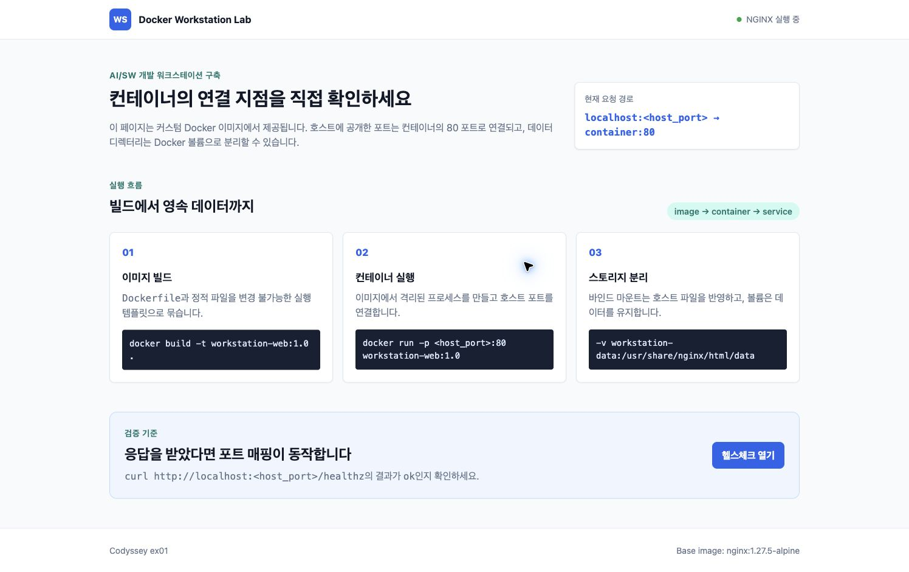
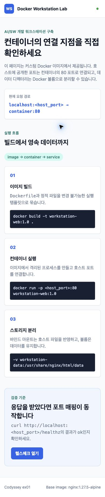

# 웹 화면과 포트 매핑 검증

2026년 7월 30일에 최종 `Dockerfile`로 이미지를 다시 빌드한 뒤, 사용자 컨테이너와 겹치지 않는 이름과 포트를 사용해 확인했습니다.

## 실행 조건

```console
$ docker build -t codex-ex01-browser:20260730 .
$ docker run -d \
    --name codex-ex01-browser-20260730 \
    -p 127.0.0.1:38082:80 \
    codex-ex01-browser:20260730
$ docker inspect --format \
    'status={{.State.Status}} health={{.State.Health.Status}} ports={{json .NetworkSettings.Ports}}' \
    codex-ex01-browser-20260730
status=running health=healthy ports={"80/tcp":[{"HostIp":"127.0.0.1","HostPort":"38082"}]}

$ curl -fsS http://127.0.0.1:38082/healthz
ok
```

호스트의 `38082` 포트를 컨테이너의 `80` 포트에 연결했습니다. `EXPOSE 80`만으로는 호스트에서 접속할 수 없고, 실행 시 `-p` 옵션으로 포트를 공개해야 합니다.

## 주소창 포함 접속 화면

Chrome의 별도 임시 프로필을 사용했습니다. 다른 탭, 계정 정보, 확장 프로그램 데이터가 없는 창만 캡처했습니다.


검증 결과:

- 주소창: `127.0.0.1:38082`
- 문서 제목: `Docker Workstation Lab`
- 화면 상태: `NGINX 실행 중`
- 컨테이너 상태: `healthy`
- HTTP 헬스체크: `ok`

## 데스크톱 화면



브라우저에서 읽은 실제 레이아웃 값입니다.

```text
viewportWidth=1496
documentWidth=1496
bodyWidth=1496
runtimeCodeOverflow=false
commandOverflow=false
```

문서 너비와 뷰포트 너비가 같으므로 페이지 수준의 가로 넘침이 없습니다. 긴 명령은 카드 안에서 줄바꿈되며 잘리지 않습니다.

## 모바일 화면



```text
viewportWidth=390
documentWidth=390
bodyWidth=390
documentHeight=1823
runtimeCodeOverflow=false
commandOverflow=false
```

390px 너비에서 헤더, 실행 단계 카드, 헬스체크 패널, 푸터가 한 열로 배치됩니다. 페이지 수준의 가로 넘침과 코드 영역 잘림은 발견되지 않았습니다.

## 제한 사항

Chrome 자동화 확장 환경에서 `/healthz`의 단독 텍스트 페이지로 이동하면 확장 프로그램이 `ERR_BLOCKED_BY_CLIENT`를 반환했습니다. 같은 주소의 실제 HTTP 응답은 `curl`에서 `200`과 `ok`로 확인했습니다. 루트 웹 화면의 브라우저 접속에는 이 문제가 없었습니다.

## 정리

증거 수집이 끝난 뒤 다음 임시 자원만 삭제했습니다.

```console
$ docker rm -f codex-ex01-browser-20260730
$ docker image rm codex-ex01-browser:20260730
```

삭제 후 같은 이름의 컨테이너와 이미지가 남지 않았음을 확인했습니다. 사용자가 기존에 실행 중이던 `workstation-web`, `workstation-backend`, 볼륨은 변경하지 않았습니다.
