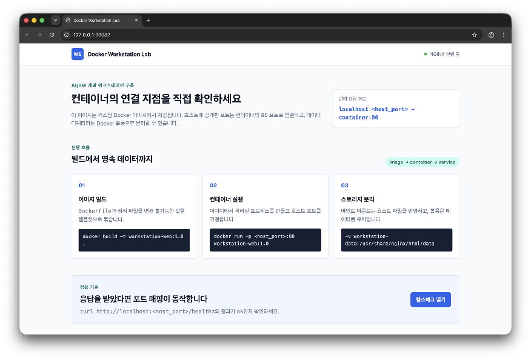

# 빌드·실행 명령 및 핵심 결과

## 빌드 및 실행

```bash
$ HOST_PORT=38082 docker compose up -d --build
codyssey_01-backend  Built
workstation-web:1.0  Built
Container codyssey_01-backend-1  Running
Container workstation-web  Started
```

`web`과 `backend` 이미지를 빌드하고 두 컨테이너를 백그라운드에서 실행했습니다.

## 실행 상태

```bash
$ HOST_PORT=38082 docker compose ps
NAME                    IMAGE                 SERVICE   STATUS                    PORTS
codyssey_01-backend-1   codyssey_01-backend   backend   Up                        8000/tcp
workstation-web         workstation-web:1.0   web       Up (healthy)              0.0.0.0:38082->80/tcp
```

두 서비스가 실행 중이며 호스트의 `38082` 포트가 `web` 컨테이너의 `80` 포트로 연결됐습니다.

## 접속 결과

```bash
$ curl -i http://127.0.0.1:38082/healthz
HTTP/1.1 200 OK
Server: nginx/1.27.5
Content-Type: text/plain

ok
```

`HTTP/1.1 200 OK`와 `ok` 응답을 통해 포트 매핑과 NGINX 실행이 정상임을 확인했습니다.

## 브라우저 접속 화면



주소창의 `127.0.0.1:38082`와 웹페이지가 함께 표시되므로 브라우저 접속 성공 증거로 사용할 수 있습니다.
